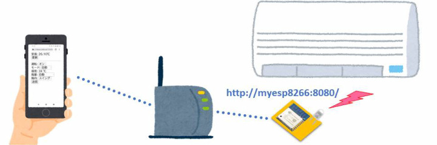
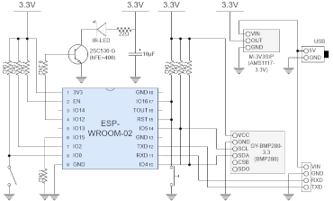
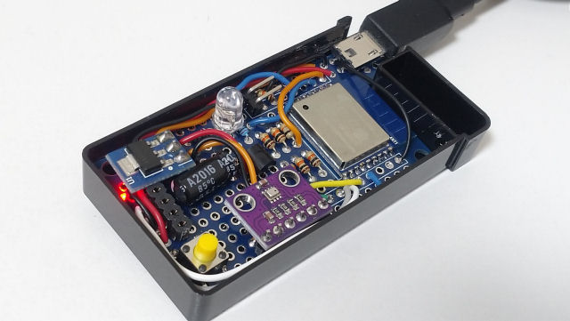
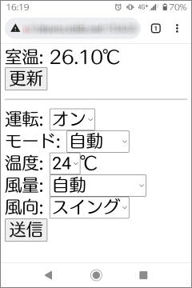

# ESP8266SmartRemocon

## Instruction

An IR signal sender using ESP-WROOM-02.

This works as a web server and can send IR signal via Web APIs.
The base URL is http://myesp8266.local:8080 as default and the method of each API is GET. 

|Path and query parameters                              |                                            |
|-------------------------------------------------------|--------------------------------------------|
|/ir/aircon?power=...&mode=...&temp=...fan=...&swing=...|Send IR signal to control an air conditioner|
|/ir/sony?value=...&bits=...&repeat=...                 |Send IR signal for Sony devices             |
|/ir/panasonic?value=...&bits=...&repeat=...            |Send IR signal for Panasonic devices        |
|/ir/nec?value=...&bits=...&repeat=...                  |Send IR signal for NEC devices              |
|/temp                                                  |Get temperature in celsius                  |
|/version                                               |Get version information                     |

* Available query parameters
    * power: `off` or `on`
    * mode: `auto` (default), `heat`, `cool`, `dry`, or `fan`
    * temp: integer `18`&ndash;`30` (default is `24`)
    * fan: `auto` (default), `level1`, `level2`, `level3`, `level4`, `level5`, or `silent`
    * swing: `swing` (default), `up`, `upmiddle`, `middle`, `downmiddle`, or `down`
    * value: hexadecimal (ex) `A50`
    * bits: integer `1`&ndash;`64` (default is `20` for Sony / `48` for Panasonic / `32` for NEC)
    * repeat: integer `0`&ndash;`8` (defualt is `2` for Sony / `0` for otherwise)

## Hardware

### Components

* [ESP-WROOM-02](http://akizukidenshi.com/catalog/g/gM-09607/)
* Temperature sensor: [GY-BMP280-3.3](https://www.aitendo.com/product/15806)
* LDO module (3.3V): [M-3V3SIP](https://www.aitendo.com/product/13061)
* IR LED: [OSI5FU5111C-40](https://akizukidenshi.com/catalog/g/gI-03261/)
* NPN Transistor (hFE 280&ndash;560): [2SC536-G](http://akizukidenshi.com/catalog/g/gI-13824/)
* Electrolytic capacitor: 10&micro;F
* Resistors: 10k&ohm;&times;7, 8.2k&ohm;&times;1, 22&ohm;&times;1
* Wires, connectors, switches, etc...

### Schematic

### Example

## Software 

### Build environment

Clone the source code and open the project file "ESP8266SmartRemocon.ino" with Arduino IDE.

You must import ESP8266 board.

This sketch depends on following libraries. (You can add these by library manager)

* [IRremoteESP8266 Library](https://github.com/crankyoldgit/IRremoteESP8266)
* [HeatpumpIR](https://github.com/ToniA/arduino-heatpumpir)
* [Adafruit Unified Sensor](https://github.com/adafruit/Adafruit_Sensor)
* [Adafruit BMP280 Library](https://github.com/adafruit/Adafruit_BMP280_Library)

You must modify ["credential.h"](credential.h) according to your situation.

* `HOSTNAME` and `PORT` if you like.
    * The URL to get version information will be http://myesp8266.local:8080/version if you don't modify.
* `STA_SSID` and `STA_PASSWORD` according to your Wi-Fi access point setting.
    * If you'd like to assign static IP address to the device, uncomment `#ifdef STATIC_ADDRESS` and edit `staticIP`, `gateway`, `subnet` and `dns`.

You can build the source code with following configuration.

* Board: "Generic ESP8266 Module"
* Builtin Led: "2"
* Upload Speed: "115200"
* CPU Frequency: "80 MHz"
* Crystal Frequency: "26 MHz"
* Flash Size: "4MB (FS:3MB OTA:~512KB"
* Flash Mode: "DOUT (compatible)"
* Flash Frequency: "40 MHz"
* Reset Method: "dtr (aka modemcu)"
* Debug port: "Disabled"
* Debug Level: "None"
* lwIP Variant: "v2 Lower Memory"
* VTables: "Flash"
* Exceptions: "Legacy (new can return nullptr)"
* Erase Flash: "Only Sketch"
* Espressif FW: "nonos-sdk 2.2.1+119 (191122)"
* SSL Support: "Basic SSL ciphers (lower ROM use)"

Then, you can transfer the firmware binary data to ESP-WROOM-02 by any means.

### (Optional) Static HTML files

The top level path of URL is mapped to the root directory of file system.
Therefore you can customize static HTML files if you transfer the file system binary data.

I provide the sample HTML files that can call /ir/aircon API with GUI. (See ["data" directory](data/))

### License

These codes are licensed under [MIT License](LICENSE).

## References

* [Arduinoライブラリでエアコン(HEAT PUMP)を制御 家庭でできるIoT！ &ndash; Under Power 研究所](https://hamayan.blog.ss-blog.jp/2019-12-06)
* [赤外線LEDの使い方（リモコン） &ndash; 電子うさぎ](https://xn--p8jqu4215bemxd.com/archives/13164)
